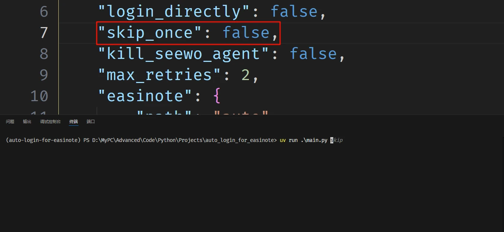

# EasiAuto


一个使用 Python 编写的 CLI 工具，可以用于自动登录希沃白板。通过 PyAutoGUI 实现自动识别并点击来模拟登录。

推荐与 [ClassIsland](https://github.com/ClassIsland/ClassIsland/) 的 **「自动化」** 功能结合使用，可实现在指定课程开始时自动登录至任课老师的希沃账号。具体自动化配置方案，详见 <https://forum.smart-teach.cn/d/725>

系统需求：Windows 10 及以上版本 | [下载](https://github.com/hxabcd/easiauto/releases/latest)

## ✨亮点

* **醒目的横幅警示**：兼具实用性与视觉冲击力


* **单次跳过**：满足特殊场景下的灵活需求



* **运行前显示警告弹窗**：让自动运行不再措不及防


* **自动错误重试**：无惧登录流程被打断

* **自动焦点切换**：解决因焦点丢失导致的登录打断

## 🪄 使用

使用已预先打包的可执行文件，直接通过命令行进行调用。

```pwsh
# 首次运行，创建配置文件
easiauto

# 查看使用说明
easiauto -h

# 运行自动登录
easiauto login -a ACCOUNT -p PASSWORD

# 跳过下一次登录
easiauto skip

```

## 🔧 配置

第一次运行程序时，会在程序所在目录下创建配置文件 `config.json`，随后程序自动退出。此时按照说明配置好自动登录选项，之后即可正常运行

可用的选项：

### `warning`

* `enabled`: 是否在自动登录前弹出警告弹窗，默认 `false`
* `timeout`: 警告弹窗的超时时长（秒），默认 `15`，范围 5~300

### `banner`

* `enabled`: 是否启用横幅警示，默认 `true`
* `text`: 横幅显示的文本内容
* `y_offset`: 横幅垂直方向的偏移量，默认 `20`

### `login`

* `skip_once`: 跳过下一次自动登录，默认 `false`
* `kill_agent`: 启动前是否终止 `SeewoAgent.exe`，默认 `true`
* `is_4k`: 是否启用 4K 模式（部分场景可能不完整），默认 `false`
* `directly`: 是否跳过点击进入登录界面，适用于不进入白板界面的情况，默认 `false`
* `easinote`:

  * `path`: 希沃白板程序路径，用于启动程序。默认 `"auto"` 表示自动查找
  * `process_name`: 进程名，用于终止进程。默认 `"EasiNote.exe"`
  * `args`: 启动参数，默认为空字符串。设置为 `"-m Display iwb"` 时可以使非希沃设备跳过强制登录，直接进入白板界面
* `timeout`（秒，不超过30的正整数）:

  * `terminate`: 终止进程等待时间，默认 `1`
  * `launch`: 启动应用等待时间，默认 `8`
  * `enter_login_ui`: 进入登录界面等待时间，默认 `3`
  * `switch_tab`: 登录界面切换选项卡等待时间，默认 `1`

### `app`

* `max_retries`: 最大重试次数，默认 `2`，范围 0~10
* `log_level`: 日志级别，支持 `DEBUG`、`INFO`、`WARNING`、`ERROR`、`CRITICAL`，默认 `WARNING`

## 开发

使用 **Python 3.13** 开发

使用 **uv** 管理项目环境

使用 **Nuitka** 构建
